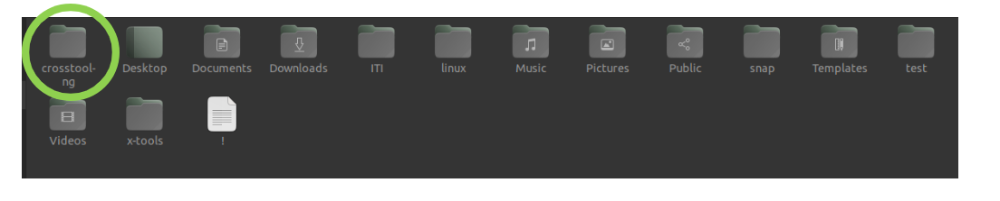
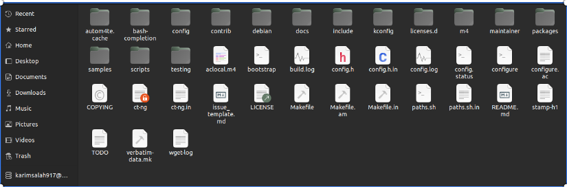
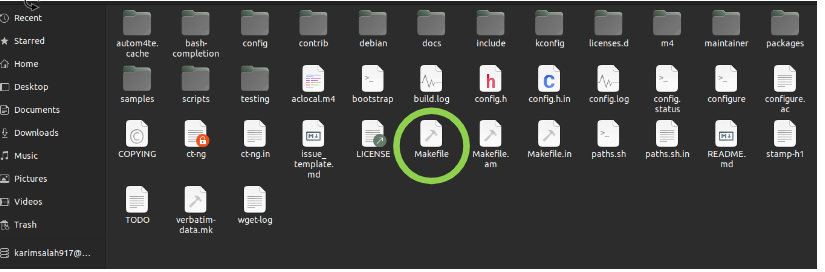

## What is CrossTool-NG?

cross tool NG is an open source application used to generate different toolchains used to compile applications like embedded applications we will use it to generate the ARM cortex a9 tool to compile different components of our Linux Image Bootloader, kernel , busybox ....etc

### 1-Download U-boot

[1] clone the program to your workspace

```bash
git clone https://github.com/crosstool-ng/crosstool-ng.git
```


[2] Go to Crosstool-NG Directory

```bash
cd crosstool-ng/
```



[3] setup the environment

```bash
./bootstrap
```

[4] Check All Dependicies

```bash
./configure --enable-local
```

[5] Generate the makefile

```bash
make
```

