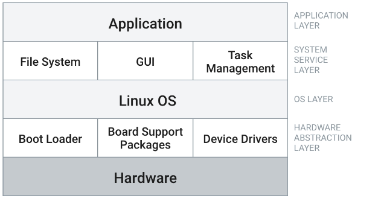

Before we talk about CrossToolNG we will talk about Linux operating system at the first

Embedded Linux systems typically consist of several components that work together to provide a complete operating environment for embedded devices. These components can vary depending on the specific requirements of the embedded system, but some common components include:

**[1] Linux Kernel:**

The core of the operating system, responsible for managing hardware resources, providing process management, memory management, and device drivers that is by using system calls.

**[2] Bootloader:**

Software responsible for loading the Linux kernel into memory and initializing the system. Common bootloaders include U-Boot and GRUB.

**[3] File System:**

The file system is responsible for organizing and storing data on the storage media. Common file systems used in embedded Linux include ext2, ext3, ext4, and YAFFS (Yet Another Flash File System).

**[4] Device Drivers:**

These are software modules that allow the operating system to communicate with and control hardware devices. Custom device drivers or those included in the Linux kernel may be used.

**[5] Init System:**

The init system is responsible for initializing the system processes during boot-up. Common init systems include Systemd, SysVinit, and BusyBox.

**[6] Toolchain:**

A set of tools, including a compiler, linker, and debugger, used for building and cross-compiling software for the target embedded system.

**[7] User Space:**

This includes the libraries, utilities, and applications that run on top of the Linux kernel. Embedded systems typically have a minimal user space tailored to the specific requirements of the device.

**[8] Networking Stack:**

Components for handling network communication, including the TCP/IP stack, Ethernet drivers, and wireless networking support.

**[9] BusyBox:**

A single binary that combines many common Unix utilities into a single executable, reducing the footprint of the user space.

**[10] Security Components:**

Security features such as firewalls, access control lists (ACLs), and encryption may be included to enhance the security of the embedded system

In the Next folders you will find a way to build a successful Linux Image on BeagleBone or Vexpress A9

don't hesitate to contact me for more info